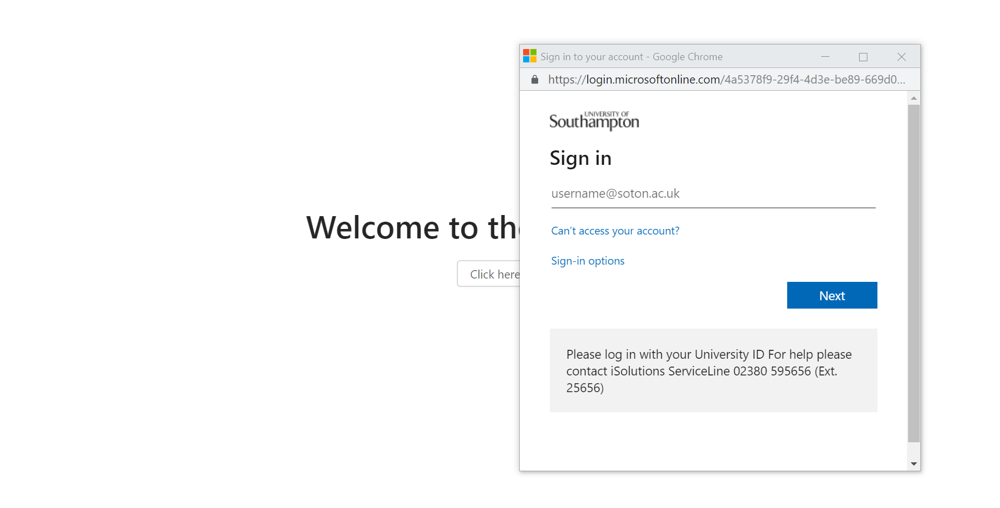
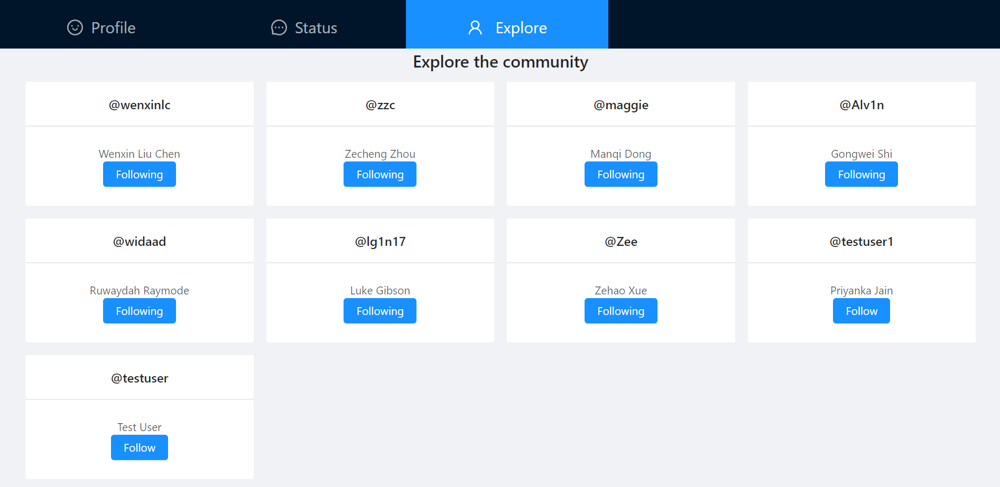

# Javascript Coursework

## Goal
- To replicate a simple social media app like Twitter and deploy it using Azure App Service
- Familarize using Azure as a cloud service
- Experience backend development using Functions-as-a-service(FaaS)
- Experience using front end Javascript framework

## Technlogy Stack
- Frontend: React.js & Ant Design (UI Component)
- Backend: Azure Functions
- Database: Azure CosmosDB
- Testing: Postman 

## Screenshot
Welcome     |     Sign In
:-------------------------:|:-------------------------:
  |  
Log in with Azure Directory | Profile
  |  
Status | Community
  |  

## Link to Resources
Resource | Website
--------|---------
Link to website | https://cmy1g17-cad-cw1.azurewebsites.net
